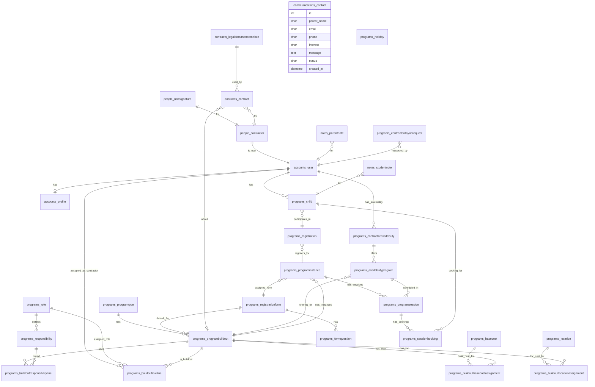

Data Model ERD

Mermaid ER Diagram

Notes
- Field names and additional attributes (choices, validators) are defined in app `models.py` files. This diagram focuses on relationships and cardinality.
- Some legacy models exist for backward compatibility (e.g., `BuildoutRoleAssignment`, `BuildoutResponsibilityAssignment`). New relationships use the `*Line` and `*Assignment` models.

